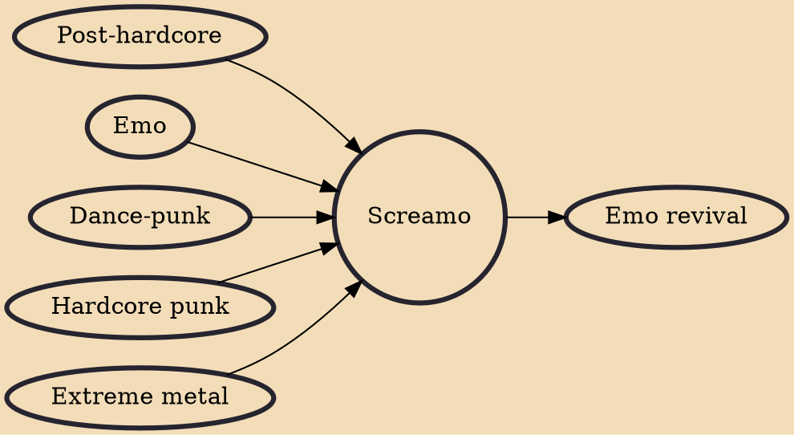

Screamo (also referred to as skramz) is an aggressive subgenre of emo that emerged in the early 1990s and emphasizes "willfully experimental dissonance and dynamics". San Diego-based bands Heroin and Antioch Arrow pioneered the genre in the early 1990s, and it was developed in the late 1990s mainly by bands from the East Coast of the United States such as Orchid, Funeral Diner, Saetia, Pg. 99, and I Hate Myself. Screamo is strongly influenced by hardcore punk and characterized by the use of screamed vocals. Lyrical themes usually include emotional pain, death, romance, and human rights. The term "screamo" has frequently been mistaken as referring to any music with screaming vocals.

## Influences
- [[Post-hardcore]]
- [[Emo]]
- [[Dance-punk]]
- [[Hardcore punk]]
- [[Extreme metal]]

## Derivatives
- [[Emo revival]]
