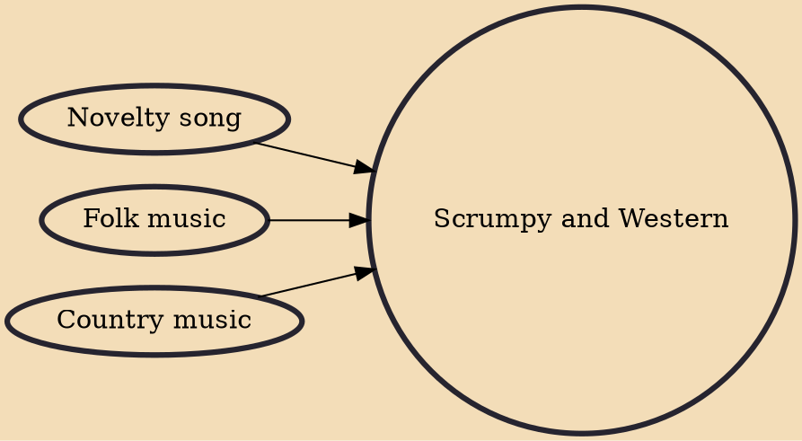

Scrumpy and Western refers humorously to music from England's West Country that fuses comical folk-style songs, often full of double entendre, with affectionate parodies of more mainstream musical genres, all delivered in the local accent/dialect. The name, taken from the title of the 1967 Scrumpy & Western EP by Adge Cutler and the Wurzels, refers to scrumpy, strongly alcoholic cider produced in the West Country; it is a play on the American genre of country and western music.

## Influences

- [[Novelty song]]
- [[Folk music]]
- [[Country music]]
