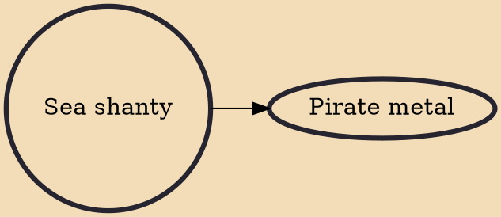

A sea shanty, chantey, or chanty (/ˈʃæntiː/) is a genre of traditional folk song that was once commonly sung as a work song to accompany rhythmical labor aboard large merchant sailing vessels. The term shanty most accurately refers to a specific style of work song belonging to this historical repertoire. However, in recent, popular usage, the scope of its definition is sometimes expanded to admit a wider range of repertoire and characteristics, or to refer to a "maritime work song" in general.

## Derivatives

- [[Pirate metal]]
