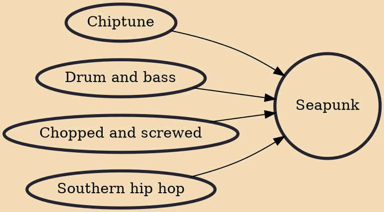

Seapunk is a subculture that originated on Tumblr in 2011. It is associated with an aquatic-themed style of fashion, 3D net art, iconography, and allusions to popular culture of the 1990s. The advent of seapunk also spawned its own electronic music microgenre, featuring elements of Southern hip hop and pop music and R&B music of the 1990s. Seapunk gained limited popularity as it spread through the Internet, although it was said to have developed a Chicago club scene.

## Influences

- [[Chiptune]]
- [[Drum and bass]]
- [[Chopped and screwed]]
- [[Southern hip hop]]
