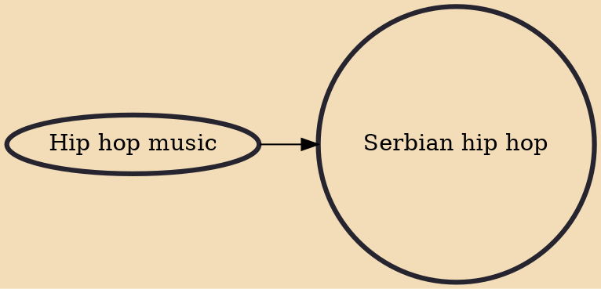

Serbian hip hop refers to all genres of hip hop music in the Serbian language. The term is also sometimes used to refer to any hip hop music made by Serbs, including instrumental hip hop, as well as rap songs by members of the Serbian diaspora, often in languages other than Serbian. Some of most prominent hip hop groups include VIP, Sunshine, p.pop Beogradski Sindikat, Bad Copy. Popular solo artists include Juice, Gru, Struka, Ajs Nigrutin, Marčelo, Zli Toni, Fox, Surreal, Furio Djunta, Demonio.

## Influences
- [[Hip hop music]]
