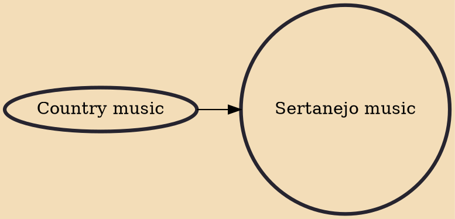

Música sertaneja (Portuguese pronunciation: [ˈmuzikɐ seʁtaˈneʒɐ]) or sertanejo (pronounced [seʁtaˈneʒu]) is a music style that had its origins in the countryside of Brazil in the 1920s. Its contemporary developments made it the most popular music style in 2000s and 2010s Brazil, particularly throughout the southern/southeastern and center-western countryside Brazil. Subgenres include sertanejo raiz, sertanejo romântico, and sertanejo universitário.

## Influences

- [[Country music]]
