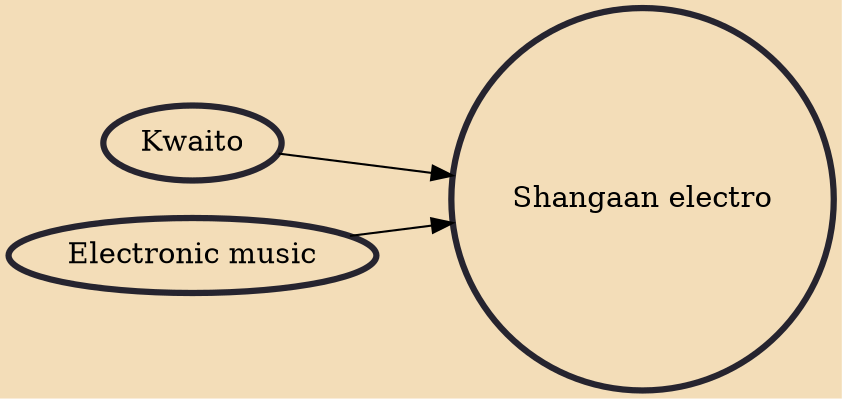

Shangaan electro is a dance movement and musical style born from a 21st-century reboot of local folk traditions in South African townships, Tsonga Disco and Kwaito House. The movement has been spearheaded by DJ Khwaya and the producer Nozinja in recent years, who has turned it into an iconic Afro-futurist strain of electronic dance music. Shangaan Electro is also called "Tsonga Electro" in the Limpopo province of South Africa.

## Influences
- [[Kwaito]]
- [[Electronic music]]
