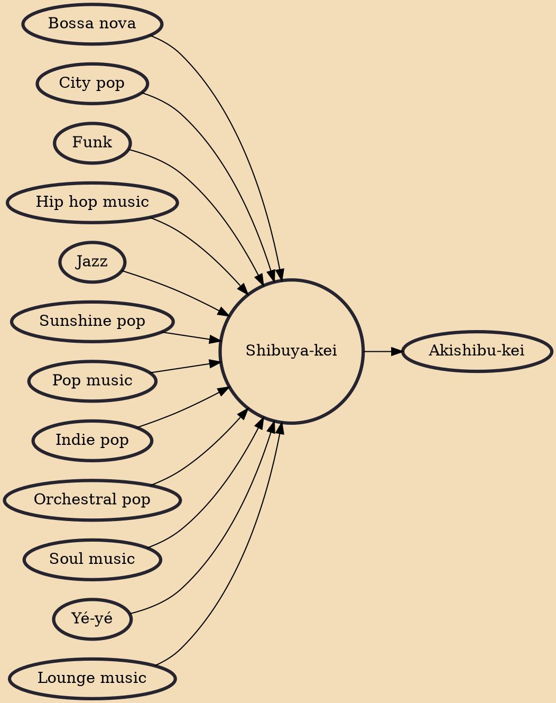

Shibuya-kei (Japanese: 渋谷系, lit. "Shibuya style") is a microgenre of pop music or a general aesthetic that flourished in Japan in the mid-to late 1990s. The music genre is distinguished by a "cut-and-paste" approach that was inspired by the kitsch, fusion, and artifice from certain music styles of the past. The most common reference points were 1960s culture and Western pop music, especially the work of Burt Bacharach, Brian Wilson, Phil Spector, and Serge Gainsbourg.

## Influences
- [[Bossa nova]]
- [[City pop]]
- [[Funk]]
- [[Hip hop music]]
- [[Jazz]]
- [[Sunshine pop]]
- [[Pop music]]
- [[Indie pop]]
- [[Orchestral pop]]
- [[Soul music]]
- [[Yé-yé]]
- [[Lounge music]]

## Derivatives
- [[Akishibu-kei]]
