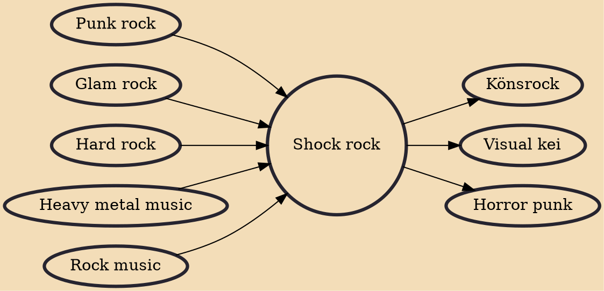

Shock rock is the combination of rock music or heavy metal music with highly theatrical live performances emphasizing shock value. Performances may include violent or provocative behavior from the artists, the use of attention-grabbing imagery such as costumes, masks, or face paint, or special effects such as pyrotechnics or fake blood. Shock rock also often includes elements of horror.

## Influences

- [[Punk rock]]
- [[Glam rock]]
- [[Hard rock]]
- [[Heavy metal music]]
- [[Rock music]]

## Derivatives

- [[Könsrock]]
- [[Visual kei]]
- [[Horror punk]]
