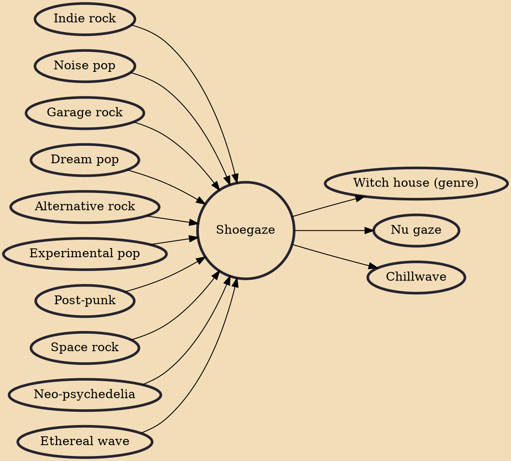

Shoegaze (originally called shoegazing and sometimes conflated with "dream pop") is a subgenre of indie and alternative rock characterized by its ethereal mixture of obscured vocals, guitar distortion and effects, feedback, and overwhelming volume. It emerged in Ireland and the United Kingdom in the late 1980s among neo-psychedelic groups who usually stood motionless during live performances in a detached, non-confrontational state. The name comes from the heavy use of effects pedals, as the performers were often looking down at their pedals during concerts.

## Influences
- [[Indie rock]]
- [[Noise pop]]
- [[Garage rock]]
- [[Dream pop]]
- [[Alternative rock]]
- [[Experimental pop]]
- [[Post-punk]]
- [[Space rock]]
- [[Neo-psychedelia]]
- [[Ethereal wave]]

## Derivatives
- [[Witch house (genre)]]
- [[Nu gaze]]
- [[Chillwave]]
