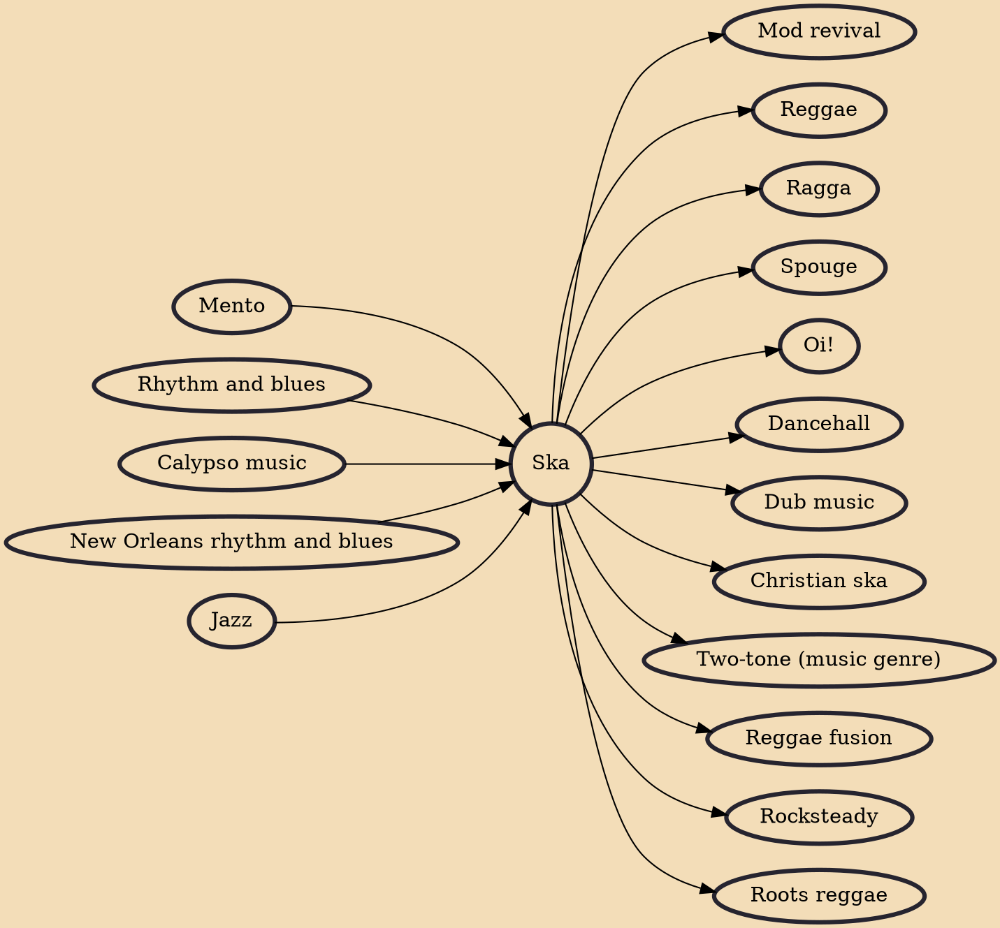

Ska (/skɑː/; Jamaican: [skjæ]) is a music genre that originated in Jamaica in the late 1950s and was the precursor to rocksteady and reggae. It combined elements of Caribbean mento and calypso with American jazz and rhythm and blues. Ska is characterized by a walking bass line accented with rhythms on the off beat. It was developed in Jamaica in the 1960s when Stranger Cole, Prince Buster, Clement "Coxsone" Dodd, and Duke Reid formed sound systems to play American rhythm and blues and then began recording their own songs. In the early 1960s, ska was the dominant music genre of Jamaica and was popular with British mods and with many skinheads.

## Influences
- [[Mento]]
- [[Rhythm and blues]]
- [[Calypso music]]
- [[New Orleans rhythm and blues]]
- [[Jazz]]

## Derivatives
- [[Mod revival]]
- [[Reggae]]
- [[Ragga]]
- [[Spouge]]
- [[Oi!]]
- [[Dancehall]]
- [[Dub music]]
- [[Christian ska]]
- [[Two-tone (music genre)]]
- [[Reggae fusion]]
- [[Rocksteady]]
- [[Roots reggae]]
