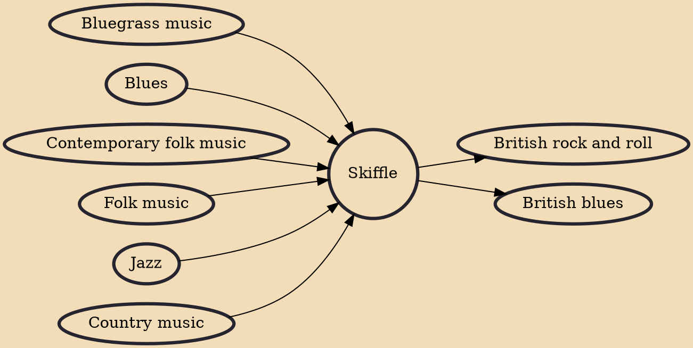

Skiffle is a genre of folk music with influences from American folk music, blues, country, bluegrass, and jazz, generally performed with a mixture of manufactured and homemade or improvised instruments. Originating as a form in the United States in the first half of the 20th century, it became extremely popular in United Kingdom in the 1950s, where it was played by such artists as Lonnie Donegan, The Vipers Skiffle Group, Ken Colyer, and Chas McDevitt. Skiffle was a major part of the early careers of some musicians who later became prominent jazz, pop, blues, folk, and rock performers, The Beatles and Rory Gallagher amongst them. It has been seen as a critical stepping stone to the second British folk revival, the British blues boom, and the British Invasion of American popular music.

## Influences
- [[Bluegrass music]]
- [[Blues]]
- [[Contemporary folk music]]
- [[Folk music]]
- [[Jazz]]
- [[Country music]]

## Derivatives
- [[British rock and roll]]
- [[British blues]]
