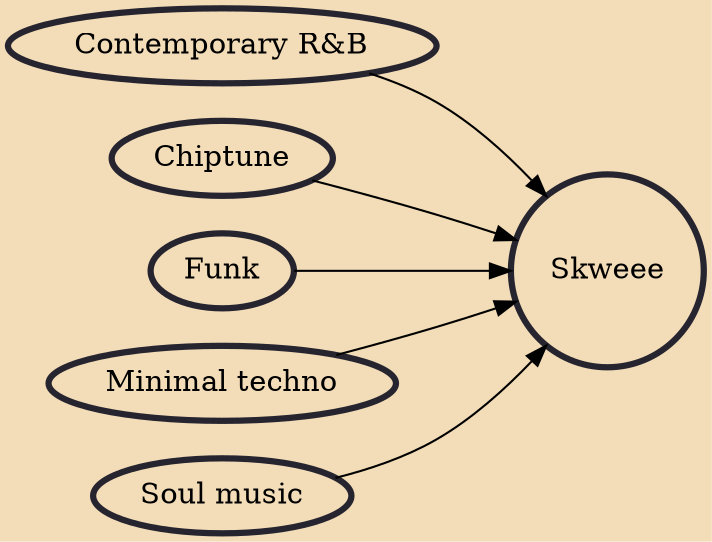

Skweee is a musical style, with origin in Sweden and Finland. Skweee combines simple synth/chiptune leads and basslines with funk, R&B or soul-like rhythms, overall rendering a stripped-down funky sound. The tracks are predominantly instrumental, though there are exceptions.

## Influences
- [[Contemporary R&B]]
- [[Chiptune]]
- [[Funk]]
- [[Minimal techno]]
- [[Soul music]]
