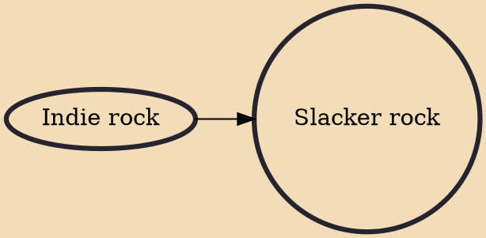

```dot
digraph {
	graph [bgcolor="#F3DDB8" rankdir=LR]
	node [color="#26242F" penwidth=3.0]
	"Slacker rock" [shape=circle]
	"Indie rock" [URL="/indie-rock/"]
	"Indie rock" -> "Slacker rock"
}
```

Slacker rock is a loosely defined genre of rock music and lo-fi music that originated in the United States in the late 1980s and early 1990s.

## Influences
- [[Indie rock]]
