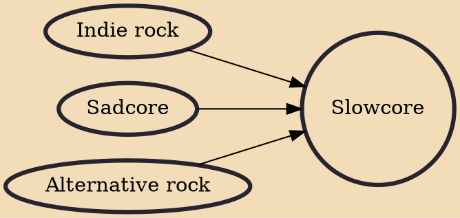

Slowcore is a subgenre of alternative rock and indie rock. The music of slowcore artists is generally characterized by bleak lyrics, downbeat melodies, slower tempos and minimalist arrangements. Slowcore is often used interchangeably with the term sadcore.

## Influences

- [[Indie rock]]
- [[Sadcore]]
- [[Alternative rock]]
