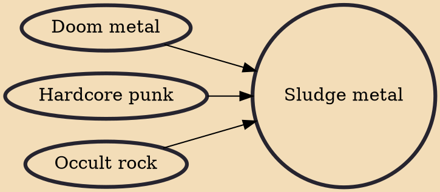

Sludge metal (also known as sludge or sludge doom) is an extreme subgenre of heavy metal music that originated through combining elements of doom metal and hardcore punk. It is typically harsh and abrasive, often featuring shouted vocals, heavily distorted instruments and sharply contrasting tempos. The Melvins from the US state of Washington produced the first sludge metal albums in the mid-late 1980s.

## Influences

- [[Doom metal]]
- [[Hardcore punk]]
- [[Occult rock]]
