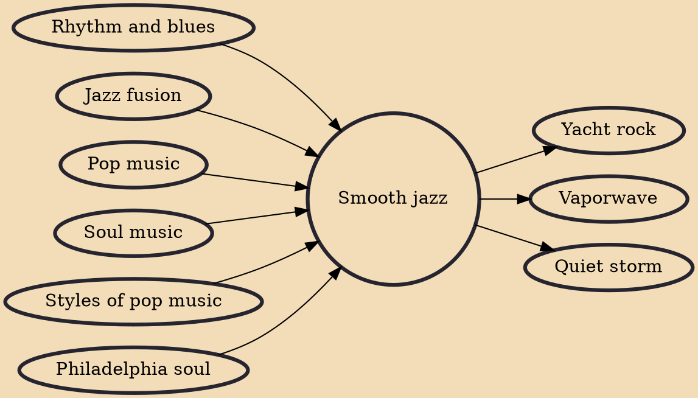

Smooth jazz is a genre of commercially-oriented crossover jazz and easy listening music that became dominant in the mid 1970s to the early 1990s.

## Influences
- [[Rhythm and blues]]
- [[Jazz fusion]]
- [[Pop music]]
- [[Soul music]]
- [[Styles of pop music]]
- [[Philadelphia soul]]

## Derivatives
- [[Yacht rock]]
- [[Vaporwave]]
- [[Quiet storm]]
