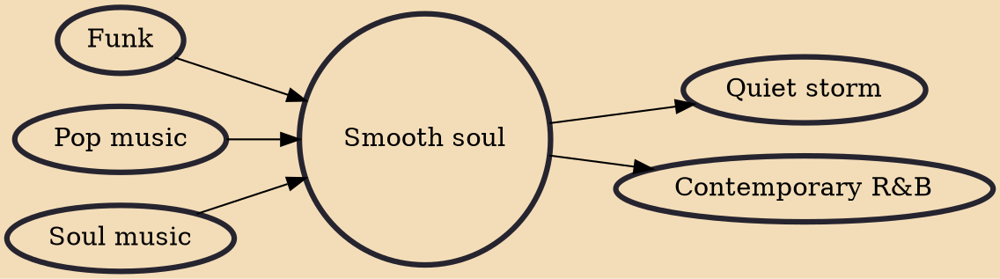

Smooth soul is a fusion genre of soul music that developed in the early 1970s from soul, funk and pop music in the United States. The fusion genre experienced mainstream success from the time of its development to the late 1970s, before its succession by disco and quiet storm.

## Influences
- [[Funk]]
- [[Pop music]]
- [[Soul music]]

## Derivatives
- [[Quiet storm]]
- [[Contemporary R&B]]
