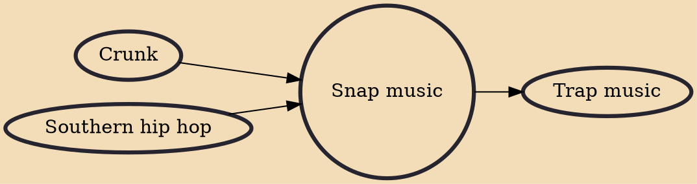

Snap music (also known as ringtone rap or snap rap) is a subgenre of hip hop music derived from crunk that originated in southern United States in the 2000s, in Bankhead, West Atlanta, United States. It achieved mainstream popularity throughout the mid-late 2000s, but declined shortly thereafter. Popular snap artists include D4L, Dem Franchize Boys and K-Rab. Crunk has been called the "predecessor of snap". Hip Hop DX magazine described snap music as a "laid back version of its forbearer [sic], crunk music".

## Influences

- [[Crunk]]
- [[Southern hip hop]]

## Derivatives

- [[Trap music]]
