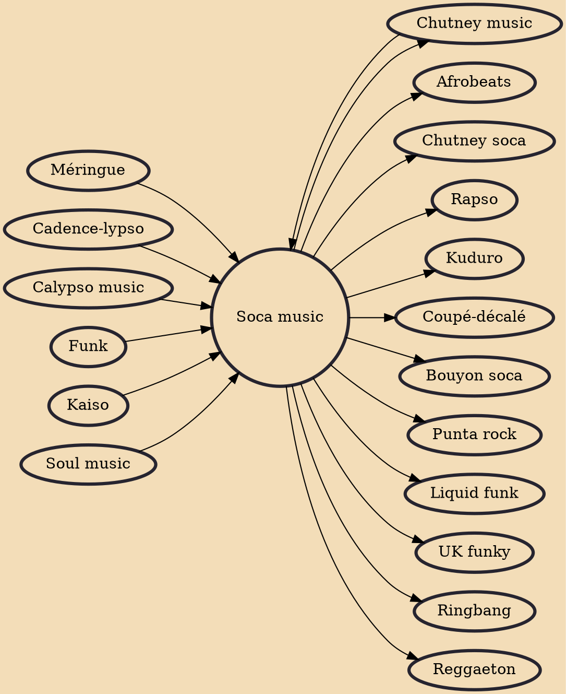

Soca music is a genre of music defined by Lord Shorty, its inventor, as the "Soul of Calypso", which has influences of African and East Indian rhythms. It was originally spelt "sokah" by its inventor but through an error in a local newspaper when reporting on the new music it was erroneously spelt "soca"; Lord Shorty confirmed the error but chose to leave it that way to avoid confusion. It is a genre of music that originated in Trinidad and Tobago in the early 1970s and developed into a range of styles during the 1980s and after. Soca was initially developed by Lord Shorty in an effort to revive traditional calypso, the popularity of which had been flagging amongst younger generations in Trinidad due to the rise in popularity of reggae from Jamaica and soul and funk from the United States.

## Influences

- [[Chutney music]]
- [[Méringue]]
- [[Cadence-lypso]]
- [[Calypso music]]
- [[Funk]]
- [[Kaiso]]
- [[Soul music]]

## Derivatives

- [[Afrobeats]]
- [[Chutney soca]]
- [[Rapso]]
- [[Kuduro]]
- [[Coupé-décalé]]
- [[Bouyon soca]]
- [[Punta rock]]
- [[Liquid funk]]
- [[UK funky]]
- [[Chutney music]]
- [[Ringbang]]
- [[Reggaeton]]
