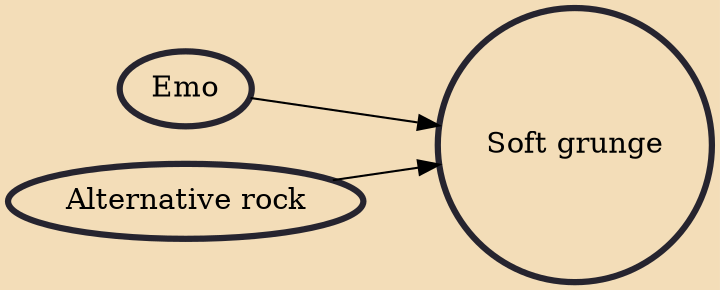

Soft grunge is a fashion trend that originated on Tumblr around the late 2000s and early 2010s, influenced by grunge fashion and other 1990s fashion styles.

## Influences

- [[Emo]]
- [[Alternative rock]]
