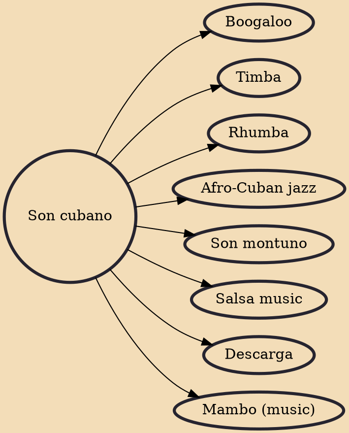

Son cubano is a genre of music and dance that originated in the highlands of eastern Cuba during the late 19th century. It is a syncretic genre that blends elements of Spanish and African origin. Among its fundamental Hispanic components are the vocal style, lyrical metre and the primacy of the tres, derived from the Spanish guitar. On the other hand, its characteristic clave rhythm, call and response structure and percussion section (bongo, maracas, etc.) are all rooted in traditions of Bantu origin.

## Derivatives

- [[Boogaloo]]
- [[Timba]]
- [[Rhumba]]
- [[Afro-Cuban jazz]]
- [[Son montuno]]
- [[Salsa music]]
- [[Descarga]]
- [[Mambo (music)]]
