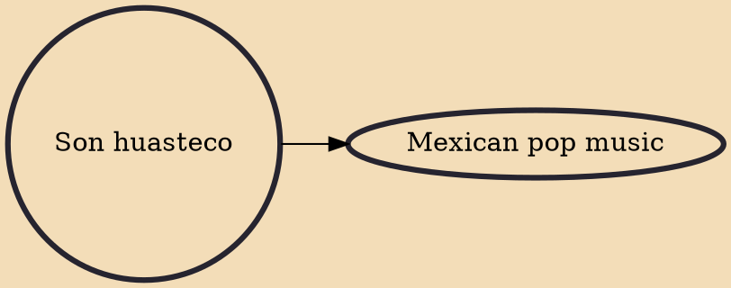

Son huasteco is one of eight Mexican song styles and is a traditional Mexican musical style originating in the six state area of Northeastern Mexico called La Huasteca. It dates back to the end of the 19th century and is influenced by Spanish and indigenous cultures. Usually it is played by a Trio Huasteco composed of a guitarra quinta huapanguera (a five course, eight stringed guitar-like instrument) a Jarana huasteca (a stringed instrument related to the jarana) and a violin. Singers will often use the falsetto register. The son huasteco is particularly noteworthy for its flamboyant and virtuoso violin parts, although the style varies from state to state. Footwork often danced to son huasteco is the Zapateado. Improvisation plays a strong role in the style, with musicians creating their

## Derivatives
- [[Mexican pop music]]
