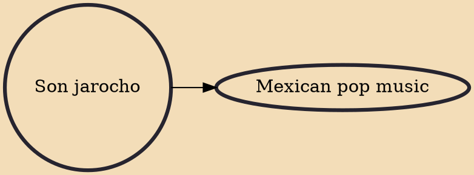

Son jarocho ("Veracruz Sound") is a regional folk musical style of Mexican Son from Veracruz, a Mexican state along the Gulf of Mexico. It evolved over the last two and a half centuries along the coastal portions of southern Tamaulipas state and Veracruz state, hence the term jarocho, a colloquial term for people or things from the port city of Veracruz.

## Derivatives
- [[Mexican pop music]]
