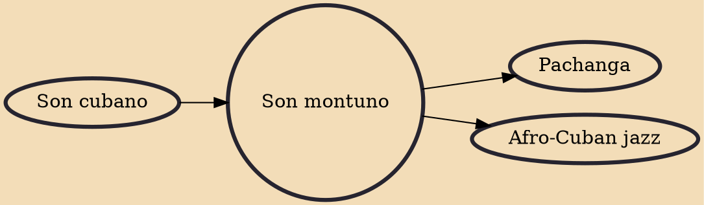

Son montuno is a subgenre of son cubano developed by Arsenio Rodríguez in the 1940s. Although son montuno ("mountain sound") had previously referred to the sones played in the mountains of eastern Cuba, Arsenio repurposed the term to denote a highly sophisticated approach to the genre in which the montuno section contained complex horn arrangements. He also incorporated piano solos and often subverted the structure of songs by starting with the montuno in a cyclic fashion. For his approach, Arsenio had to expand the existing septeto ensemble into the conjunto format which became the norm in the 1940s alongside big bands. Arsenio's developments eventually served as the template for the development of genres such as salsa, songo and timba.

## Influences
- [[Son cubano]]

## Derivatives
- [[Pachanga]]
- [[Afro-Cuban jazz]]
