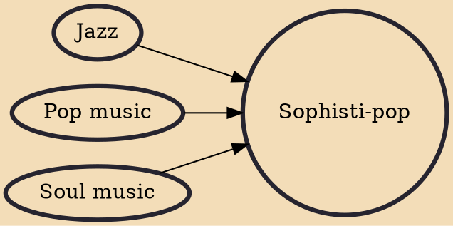

Sophisti-pop is a subgenre of pop music which developed out of the new wave movement in the UK during the mid 1980s. The term has been applied retrospectively to describe acts who blended elements of jazz, soul, and pop with lavish production. Music so classified often made extensive use of electronic keyboards, synthesizers and polished arrangements. Artists also utilized cutting-edge studio technology and perfectionist recording methods. The genre has been described as mellow, romantic, and atmospheric.

## Influences

- [[Jazz]]
- [[Pop music]]
- [[Soul music]]
