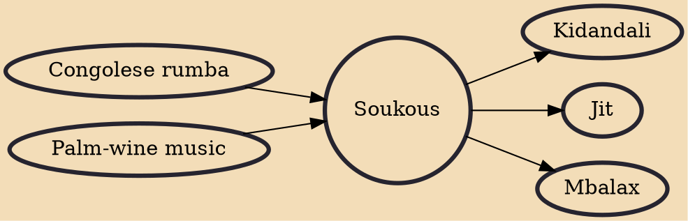

Soukous (from French secousse, "shock, jolt, jerk") is a genre of dance music from Congo-Kinshasa and Congo-Brazzaville. It derived from Congolese rumba in the 1960s, becoming known for its fast dance rhythms and intricate guitar improvisation, and gained popularity in the 1980s in France. Although often used by journalists as a synonym for Congolese rumba, both the music and dance associated with soukous differ from more traditional rumba, especially in its higher tempo and longer dance sequences. Notable performers of the genre include Franco Luambo and his band TPOK Jazz, Papa Wemba, Sam Mangwana, Tabu Ley Rochereau, and Pépé Kallé.

## Influences
- [[Congolese rumba]]
- [[Palm-wine music]]

## Derivatives
- [[Kidandali]]
- [[Jit]]
- [[Mbalax]]
