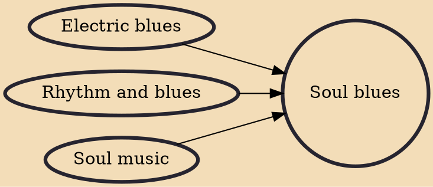

Soul blues is a style of blues music developed in the late 1960s and early 1970s that combines elements of soul music and urban contemporary music.

## Influences
- [[Electric blues]]
- [[Rhythm and blues]]
- [[Soul music]]
