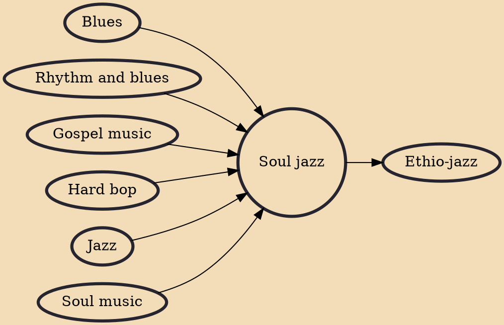

Soul jazz or funky jazz is a subgenre of jazz that incorporates strong influences from hard bop, blues, soul, gospel and rhythm and blues. Soul jazz is often characterized by organ trios featuring the Hammond organ and small combos including tenor saxophone, guitar, and organ. Its origins were in the 1950s and early 1960s, with its heyday with popular audiences preceding the rise of jazz fusion in the late 1960s and 1970s. Prominent names in fusion ranged from bop pianists including Bobby Timmons and Junior Mance to a wide range of organists, saxophonists, and guitarists including Jack McDuff, Eddie "Lockjaw" Davis, and Grant Green.

## Influences

- [[Blues]]
- [[Rhythm and blues]]
- [[Gospel music]]
- [[Hard bop]]
- [[Jazz]]
- [[Soul music]]

## Derivatives

- [[Ethio-jazz]]
