```dot
digraph {
	graph [bgcolor="#F3DDB8" rankdir=LR]
	node [color="#26242F" penwidth=3.0]
	"Soul music" [shape=circle]
	"Rhythm and blues" [URL="/rhythm-and-blues/"]
	"Rhythm and blues" -> "Soul music"
	"Doo-wop" [URL="/doo-wop/"]
	"Doo-wop" -> "Soul music"
	"Gospel music" [URL="/gospel-music/"]
	"Gospel music" -> "Soul music"
	"Traditional black gospel" [URL="/traditional-black-gospel/"]
	"Traditional black gospel" -> "Soul music"
	"Rock music" [URL="/rock-music/"]
	"Soul music" -> "Rock music"
	"Adult contemporary music" [URL="/adult-contemporary-music/"]
	"Soul music" -> "Adult contemporary music"
	"Contemporary R&B" [URL="/contemporary-rb/"]
	"Soul music" -> "Contemporary R&B"
	"Mangue bit" [URL="/mangue-bit/"]
	"Soul music" -> "Mangue bit"
	"Sri Lankan hip hop" [URL="/sri-lankan-hip-hop/"]
	"Soul music" -> "Sri Lankan hip hop"
	"Classic soul" [URL="/classic-soul/"]
	"Soul music" -> "Classic soul"
	"Latin soul" [URL="/latin-soul/"]
	"Soul music" -> "Latin soul"
	"Reggae fusion" [URL="/reggae-fusion/"]
	"Soul music" -> "Reggae fusion"
	"Acid jazz" [URL="/acid-jazz/"]
	"Soul music" -> "Acid jazz"
	"Sophisti-pop" [URL="/sophisti-pop/"]
	"Soul music" -> "Sophisti-pop"
	"Progressive rap" [URL="/progressive-rap/"]
	"Soul music" -> "Progressive rap"
	"Brit funk" [URL="/brit-funk/"]
	"Soul music" -> "Brit funk"
	"Australian hip hop" [URL="/australian-hip-hop/"]
	"Soul music" -> "Australian hip hop"
	"Progressive soul" [URL="/progressive-soul/"]
	"Soul music" -> "Progressive soul"
	"Motown (music style)" [URL="/motown-music-style/"]
	"Soul music" -> "Motown (music style)"
	"Cinematic soul" [URL="/cinematic-soul/"]
	"Soul music" -> "Cinematic soul"
	"Smooth jazz" [URL="/smooth-jazz/"]
	"Soul music" -> "Smooth jazz"
	"Garage rock" [URL="/garage-rock/"]
	"Soul music" -> "Garage rock"
	"Diva house" [URL="/diva-house/"]
	"Soul music" -> "Diva house"
	"Jazz-funk" [URL="/jazz-funk/"]
	"Soul music" -> "Jazz-funk"
	Skweee [URL="/skweee/"]
	"Soul music" -> Skweee
	"Smooth soul" [URL="/smooth-soul/"]
	"Soul music" -> "Smooth soul"
	"West Coast hip hop" [URL="/west-coast-hip-hop/"]
	"Soul music" -> "West Coast hip hop"
	"Ethio-jazz" [URL="/ethio-jazz/"]
	"Soul music" -> "Ethio-jazz"
	"Philadelphia soul" [URL="/philadelphia-soul/"]
	"Soul music" -> "Philadelphia soul"
	Reggae [URL="/reggae/"]
	"Soul music" -> Reggae
	"Lovers' rock" [URL="/lovers-rock/"]
	"Soul music" -> "Lovers' rock"
	Afrobeat [URL="/afrobeat/"]
	"Soul music" -> Afrobeat
	"Deep house" [URL="/deep-house/"]
	"Soul music" -> "Deep house"
	"Hip hop tuga" [URL="/hip-hop-tuga/"]
	"Soul music" -> "Hip hop tuga"
	"Hip hop soul" [URL="/hip-hop-soul/"]
	"Soul music" -> "Hip hop soul"
	"Shibuya-kei" [URL="/shibuya-kei/"]
	"Soul music" -> "Shibuya-kei"
	"Indian hip hop" [URL="/indian-hip-hop/"]
	"Soul music" -> "Indian hip hop"
	"Soul blues" [URL="/soul-blues/"]
	"Soul music" -> "Soul blues"
	"Yacht rock" [URL="/yacht-rock/"]
	"Soul music" -> "Yacht rock"
	Disco [URL="/disco/"]
	"Soul music" -> Disco
	"City pop" [URL="/city-pop/"]
	"Soul music" -> "City pop"
	"Northern soul" [URL="/northern-soul/"]
	"Soul music" -> "Northern soul"
	"Samba rock" [URL="/samba-rock/"]
	"Soul music" -> "Samba rock"
	"Post-disco" [URL="/post-disco/"]
	"Soul music" -> "Post-disco"
	"Chicago soul" [URL="/chicago-soul/"]
	"Soul music" -> "Chicago soul"
	"Desi hip hop" [URL="/desi-hip-hop/"]
	"Soul music" -> "Desi hip hop"
	"Soul jazz" [URL="/soul-jazz/"]
	"Soul music" -> "Soul jazz"
	"Afro-soul" [URL="/afro-soul/"]
	"Soul music" -> "Afro-soul"
	"Psychedelic soul" [URL="/psychedelic-soul/"]
	"Soul music" -> "Psychedelic soul"
	"Memphis soul" [URL="/memphis-soul/"]
	"Soul music" -> "Memphis soul"
	"Car song" [URL="/car-song/"]
	"Soul music" -> "Car song"
	Funk [URL="/funk/"]
	"Soul music" -> Funk
	"Urban Pasifika" [URL="/urban-pasifika/"]
	"Soul music" -> "Urban Pasifika"
	"Swamp rock" [URL="/swamp-rock/"]
	"Soul music" -> "Swamp rock"
	"Southern soul" [URL="/southern-soul/"]
	"Soul music" -> "Southern soul"
	"Old-school hip hop" [URL="/old-school-hip-hop/"]
	"Soul music" -> "Old-school hip hop"
	"Soca music" [URL="/soca-music/"]
	"Soul music" -> "Soca music"
	"Mod revival" [URL="/mod-revival/"]
	"Soul music" -> "Mod revival"
	"British soul" [URL="/british-soul/"]
	"Soul music" -> "British soul"
	"Retro-soul" [URL="/retro-soul/"]
	"Soul music" -> "Retro-soul"
	"Bangladeshi hip hop" [URL="/bangladeshi-hip-hop/"]
	"Soul music" -> "Bangladeshi hip hop"
	"New York soul" [URL="/new-york-soul/"]
	"Soul music" -> "New York soul"
	"Alternative hip hop" [URL="/alternative-hip-hop/"]
	"Soul music" -> "Alternative hip hop"
	Boogaloo [URL="/boogaloo/"]
	"Soul music" -> Boogaloo
	Rocksteady [URL="/rocksteady/"]
	"Soul music" -> Rocksteady
}
```

Soul music is a popular music genre that originated in the African American community throughout the United States in the late 1950s and early 1960s. It has its roots in African-American gospel music, rhythm and blues. Soul music became popular for dancing and listening, where U.S. record labels such as Motown, Atlantic and Stax were influential during the Civil Rights Movement. Soul also became popular around the world, directly influencing rock music and the music of Africa. It also had a resurgence with artists like Erykah Badu under the genre neo-soul.

## Influences

- [[Rhythm and blues]]
- [[Doo-wop]]
- [[Gospel music]]
- [[Traditional black gospel]]

## Derivatives

- [[Rock music]]
- [[Adult contemporary music]]
- [[Contemporary R&B]]
- [[Mangue bit]]
- [[Sri Lankan hip hop]]
- [[Classic soul]]
- [[Latin soul]]
- [[Reggae fusion]]
- [[Acid jazz]]
- [[Sophisti-pop]]
- [[Progressive rap]]
- [[Brit funk]]
- [[Australian hip hop]]
- [[Progressive soul]]
- [[Motown (music style)]]
- [[Cinematic soul]]
- [[Smooth jazz]]
- [[Garage rock]]
- [[Diva house]]
- [[Jazz-funk]]
- [[Skweee]]
- [[Smooth soul]]
- [[West Coast hip hop]]
- [[Ethio-jazz]]
- [[Philadelphia soul]]
- [[Reggae]]
- [[Lovers' rock]]
- [[Afrobeat]]
- [[Deep house]]
- [[Hip hop tuga]]
- [[Hip hop soul]]
- [[Shibuya-kei]]
- [[Indian hip hop]]
- [[Soul blues]]
- [[Yacht rock]]
- [[Disco]]
- [[City pop]]
- [[Northern soul]]
- [[Samba rock]]
- [[Post-disco]]
- [[Chicago soul]]
- [[Desi hip hop]]
- [[Soul jazz]]
- [[Afro-soul]]
- [[Psychedelic soul]]
- [[Memphis soul]]
- [[Car song]]
- [[Funk]]
- [[Urban Pasifika]]
- [[Swamp rock]]
- [[Southern soul]]
- [[Old-school hip hop]]
- [[Soca music]]
- [[Mod revival]]
- [[British soul]]
- [[Retro-soul]]
- [[Bangladeshi hip hop]]
- [[New York soul]]
- [[Alternative hip hop]]
- [[Boogaloo]]
- [[Rocksteady]]
