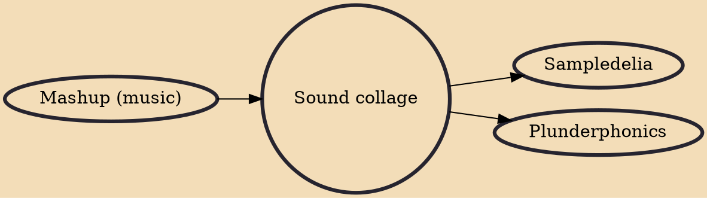

In music, montage (literally "putting together") or sound collage ("gluing together") is a technique where newly branded sound objects or compositions, including songs, are created from collage, also known as montage. This is often done through the use of sampling, while some playable sound collages were produced by gluing together sectors of different vinyl records. In any case, it may be achieved through the use of previous sound recordings or musical scores. Like its visual cousin, the collage work may have a completely different effect than that of the component parts, even if the original parts are completely recognizable or from only one source.

## Influences

- [[Mashup (music)]]

## Derivatives

- [[Sampledelia]]
- [[Plunderphonics]]
