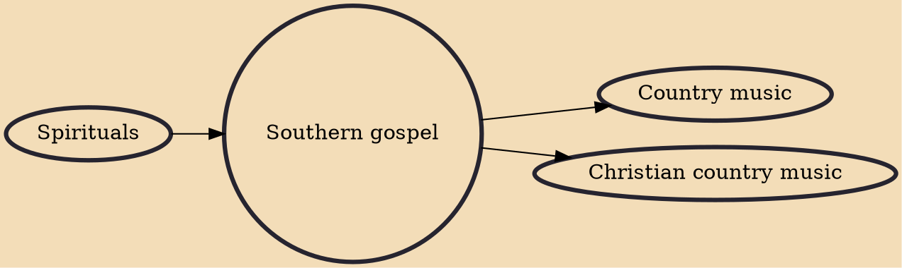

Southern gospel music is a genre of Christian music. Its name comes from its origins in the southeastern United States. Its lyrics are written to express either personal or a communal faith regarding biblical teachings and Christian life, as well as (in terms of the varying music styles) to give a Christian alternative to mainstream secular music. Sometimes known as "quartet music" for its traditional "four men and a piano" set up, southern gospel has evolved over the years into a popular form of music across the United States and overseas, especially among baby boomers and those living in the Southern United States. Like other forms of music, the creation, performance, significance, and even the definition of southern gospel varies according to the cultural and social context. It is compo

## Influences

- [[Spirituals]]

## Derivatives

- [[Country music]]
- [[Christian country music]]
