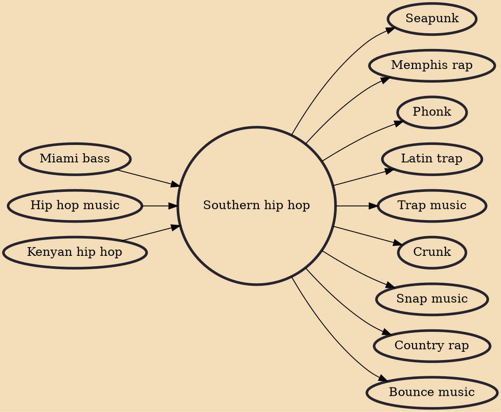

Southern hip hop, also known as Southern rap, South Coast hip hop, or dirty south, is a blanket term for a regional genre of American hip hop music that emerged in the Southern United States, especially in Atlanta, New Orleans, Houston, Memphis, and Miami—five cities which constitute the "Southern Network" in rap music.

## Influences
- [[Miami bass]]
- [[Hip hop music]]
- [[Kenyan hip hop]]

## Derivatives
- [[Seapunk]]
- [[Memphis rap]]
- [[Phonk]]
- [[Latin trap]]
- [[Trap music]]
- [[Crunk]]
- [[Snap music]]
- [[Country rap]]
- [[Bounce music]]
