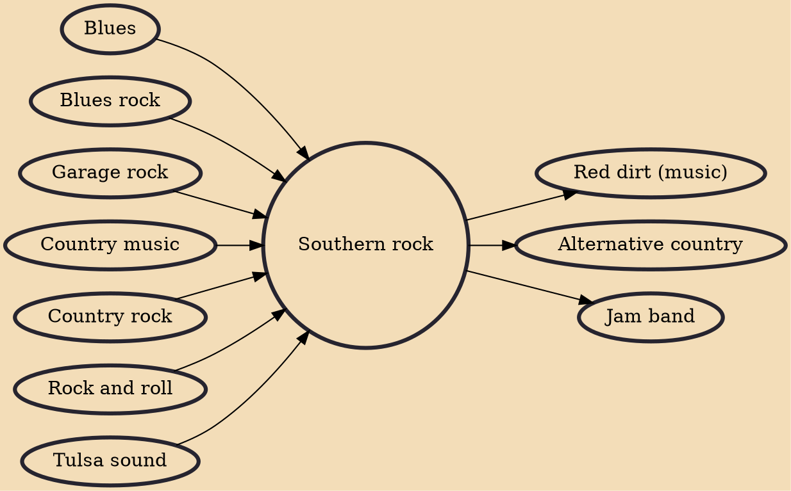

Southern rock is a subgenre of rock music and a genre of Americana. It developed in the Southern United States from rock and roll, country music, and blues and is focused generally on electric guitars and vocals. Author Scott B. Bomar speculates the term "southern rock" may have been coined in 1972 by Mo Slotin, writing for Atlanta's underground paper, The Great Speckled Bird, in a review of an Allman Brothers Band concert.

## Influences
- [[Blues]]
- [[Blues rock]]
- [[Garage rock]]
- [[Country music]]
- [[Country rock]]
- [[Rock and roll]]
- [[Tulsa sound]]

## Derivatives
- [[Red dirt (music)]]
- [[Alternative country]]
- [[Jam band]]
