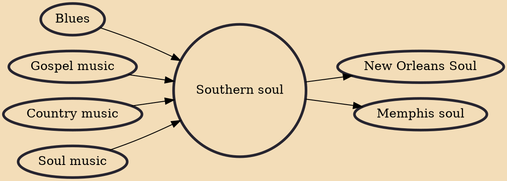

Southern soul is a type of soul music that emerged from the Southern United States. The music originated from a combination of styles, including blues (both 12 bar and jump), country, early R&B, and a strong gospel influence that emanated from the sounds of Southern black churches. Bass guitar, drums, horn section, and gospel roots vocal are important to soul groove. This rhythmic force made it a strong influence in the rise of funk music. The terms "deep soul", "country soul", "downhome soul" and "hard soul" have been used synonymously with "Southern soul".p. 18

## Influences

- [[Blues]]
- [[Gospel music]]
- [[Country music]]
- [[Soul music]]

## Derivatives

- [[New Orleans Soul]]
- [[Memphis soul]]
