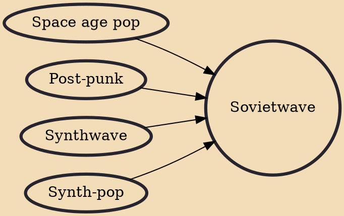

Sovietwave (also styled Soviet wave or Soviet-wave) is a subgenre of synthwave music and an online aesthetic which originates from a number of post-Soviet states, primarily Russia. It is characterized by themes associated with the Soviet Union (such as Soviet-style space age technology, military parades, apartment blocks etc.) and is part of the cultural phenomenon of nostalgia for the Soviet Union.

## Influences
- [[Space age pop]]
- [[Post-punk]]
- [[Synthwave]]
- [[Synth-pop]]
