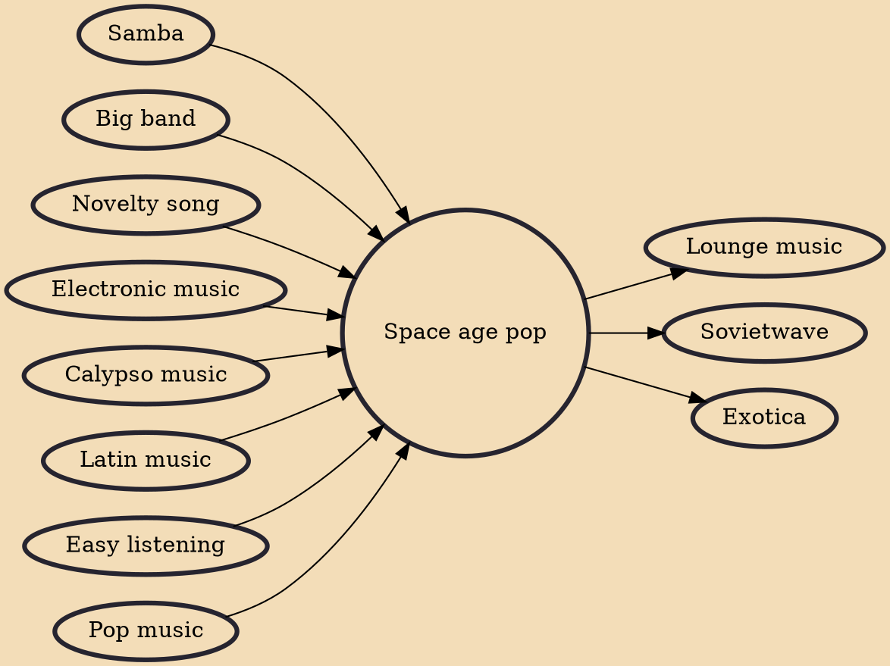

Space age pop is a subgenre of pop and easy listening music associated with Mexican and American composers and songwriters in the Space Age of the 1950s and 1960s. Also known as bachelor pad music or lounge music, it was inspired by the spirit of those times, an optimism based on the strong post-war economy and technology boom, and excitement about humanity's early forays into space. Although there is no exact album, date, or year when the genre was born, producer Irwin Chusid identifies its heyday as "roughly 1954 to 1963—from the dawn of high-fidelity (hi-fi) to the arrival of the Beatles."

## Influences
- [[Samba]]
- [[Big band]]
- [[Novelty song]]
- [[Electronic music]]
- [[Calypso music]]
- [[Latin music]]
- [[Easy listening]]
- [[Pop music]]

## Derivatives
- [[Lounge music]]
- [[Sovietwave]]
- [[Exotica]]
