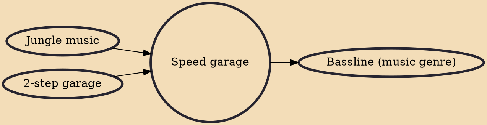

Speed garage (occasionally known as plus-8) is a genre of electronic dance music, associated with the UK garage scene, of which it is regarded as one of its subgenres.

## Influences

- [[Jungle music]]
- [[2-step garage]]

## Derivatives

- [[Bassline (music genre)]]
