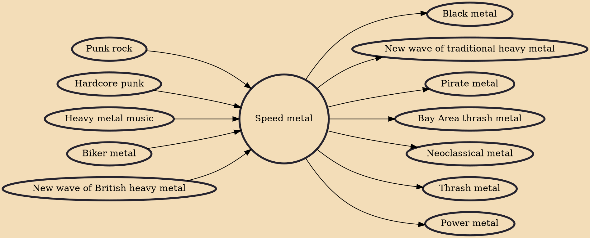

Speed metal is an extreme subgenre of heavy metal music that originated in the late 1970s from new wave of British heavy metal (NWOBHM) roots. It is described by AllMusic as "extremely fast, abrasive, and technically demanding" music.

## Influences

- [[Punk rock]]
- [[Hardcore punk]]
- [[Heavy metal music]]
- [[Biker metal]]
- [[New wave of British heavy metal]]

## Derivatives

- [[Black metal]]
- [[New wave of traditional heavy metal]]
- [[Pirate metal]]
- [[Bay Area thrash metal]]
- [[Neoclassical metal]]
- [[Thrash metal]]
- [[Power metal]]
