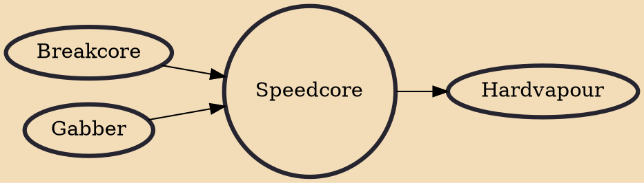

Speedcore is a form of electronic music that is characterized by a high tempo and aggressive themes. It was created in the early to mid-1990s and the name originates from the hardcore genre as well as the high-speed tempo used. This music rarely drops below 300 beats per minute (bpm). Earlier speedcore tracks often averaged at about 250 bpm, which could be defined as terror(core), whereas some tracks exceed 1000 bpm where it becomes known as extratone.

## Influences

- [[Breakcore]]
- [[Gabber]]

## Derivatives

- [[Hardvapour]]
