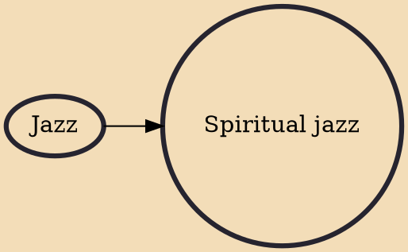

Spiritual jazz (or astral jazz) is a sub-genre of jazz that originated in the United States during the 1960s. The genre is hard to characterize musically but draws from free, avant-garde and modal jazz and thematically focuses on transcendence and spirituality. John Coltrane's 1965 album A Love Supreme is considered landmark in the genre.

## Influences
- [[Jazz]]
