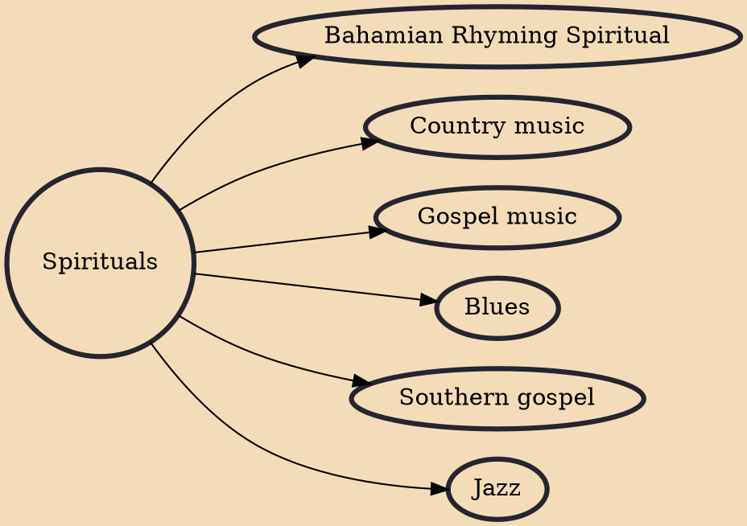

Spirituals (also known as Negro spirituals, African American spirituals, Black spirituals, or spiritual music) is a genre of Christian music that is associated with Black Americans, which merged sub-Saharan African cultural heritage with the experiences of being held in bondage in slavery, at first during the transatlantic slave trade and for centuries afterwards, through the domestic slave trade. Spirituals encompass the "sing songs," work songs, and plantation songs that evolved into the blues and gospel songs in church. In the nineteenth century, the word "spirituals" referred to all these subcategories of folk songs. While they were often rooted in biblical stories, they also described the extreme hardships endured by African Americans who were enslaved from the 17th century until the

## Derivatives

- [[Bahamian Rhyming Spiritual]]
- [[Country music]]
- [[Gospel music]]
- [[Blues]]
- [[Southern gospel]]
- [[Jazz]]
