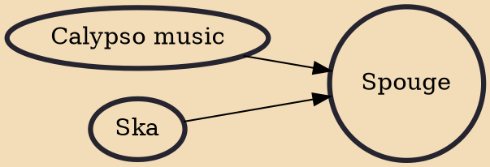

Spouge is a style of Barbadian popular music created by Jackie Opel in the 1960s. It is primarily a fusion of Jamaican ska with Trinidadian calypso, but is also influenced by a wide variety of musics from the British Isles and United States, including sea shanties, hymns, and spirituals. Spouge instrumentation originally consisted of cowbell, bass guitar, trap set, and various other electronic and percussion instruments, later augmented by saxophone, trombone, and trumpets. Of these, the cowbell and the guitar are widely seen as the most integral part of the instrumentation, and are said to reflect the African origin of much of Barbadian music.

## Influences
- [[Calypso music]]
- [[Ska]]
