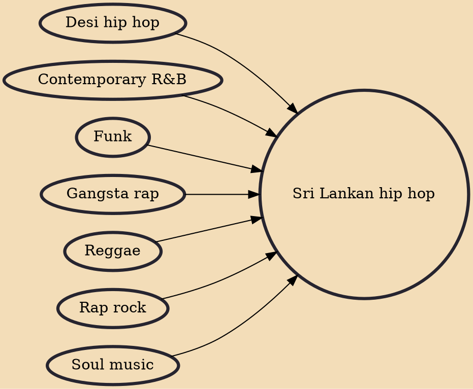

Sri Lankan Hip Hop is a part of the Asian hip hop culture. This multilingual genre features Sinhala, Tamil and English.

## Influences
- [[Desi hip hop]]
- [[Contemporary R&B]]
- [[Funk]]
- [[Gangsta rap]]
- [[Reggae]]
- [[Rap rock]]
- [[Soul music]]
