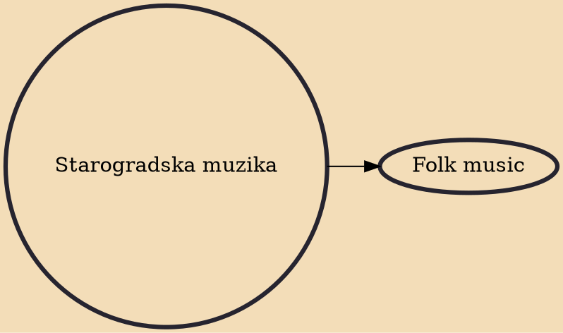

Starogradska muzika (Bulgarian: Macedonian: Serbian: староградска музика, Croatian: starogradska glazba; literally "old city music") is an urban traditional folk music of Bulgaria, Bosnia Hercegovina, Croatia, North Macedonia and Serbia.

## Derivatives

- [[Folk music]]
