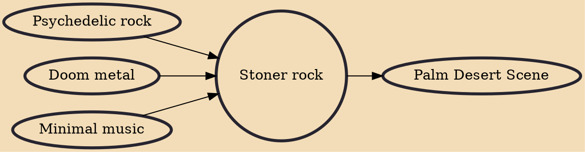

Stoner rock, also known as stoner metal or stoner doom, is a rock music fusion genre that combines elements of doom metal with psychedelic rock and acid rock. The genre emerged during the early 1990s and was pioneered foremost by Kyuss and Sleep.

## Influences
- [[Psychedelic rock]]
- [[Doom metal]]
- [[Minimal music]]

## Derivatives
- [[Palm Desert Scene]]
