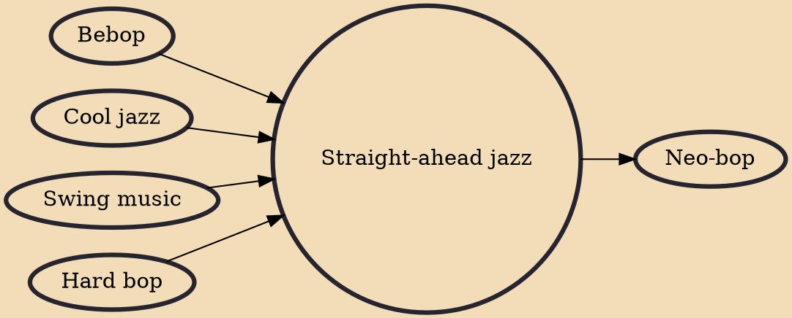

Straight-ahead jazz is a genre of jazz that developed in the 1960s, with roots in the prior two decades. It omits the rock music and free jazz influences that began to appear in jazz during this period, instead preferring acoustic instruments, conventional piano comping, walking bass patterns, and swing- and bop-based drum rhythms.

## Influences
- [[Bebop]]
- [[Cool jazz]]
- [[Swing music]]
- [[Hard bop]]

## Derivatives
- [[Neo-bop]]
