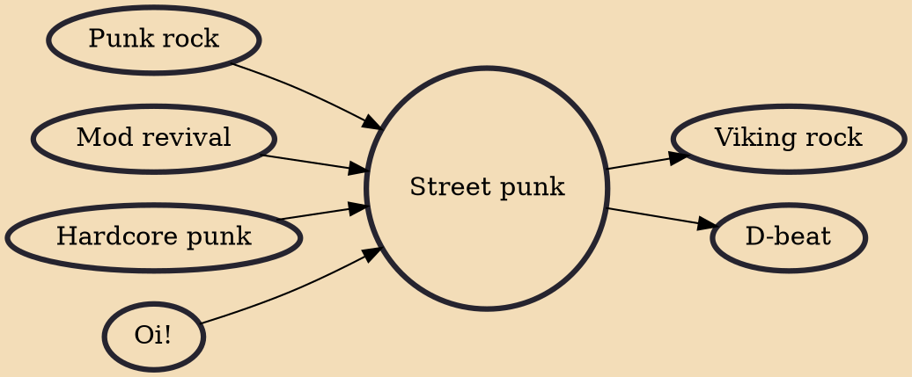

Street punk (sometimes alternatively spelled streetpunk) is an urban working class-based subgenre of punk rock, which partly emerged as a rebellion against the perceived artistic pretensions of the first wave of British punk. Street punk emerged from the style of Oi! and hardcore punk bands. A key band in defining the aesthetic was the Exploited. Street punks generally have a much more ostentatious and flamboyant appearance than the working class or skinhead image cultivated by many Oi! groups. Street punks commonly sported multi-coloured hair, mohawks, tattoos, heavily studded vests and leather jackets, and clothing, especially plaids, adorned with political slogans, patches, and/or the names of punk bands. In the 1990s and 2000s, a street punk revival began with emerging street punk band

## Influences

- [[Punk rock]]
- [[Mod revival]]
- [[Hardcore punk]]
- [[Oi!]]

## Derivatives

- [[Viking rock]]
- [[D-beat]]
