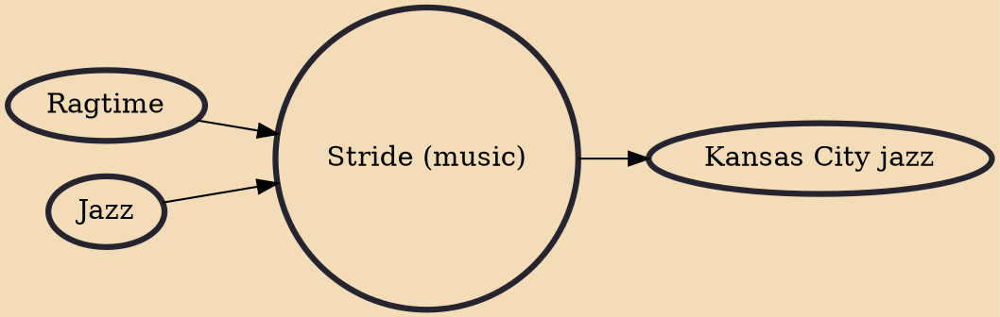

Stride jazz piano, often shortened to stride, is a jazz piano style that arose from ragtime players. Prominent stride pianists include James P. Johnson, Willie "the Lion" Smith, Fats Waller, Luckey Roberts, Mrs Mills and Mary Lou Williams.

## Influences

- [[Ragtime]]
- [[Jazz]]

## Derivatives

- [[Kansas City jazz]]
