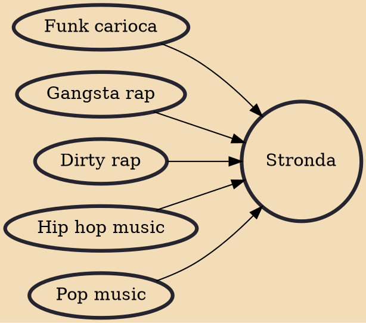

Stronda is a subgenre of Brazilian hip hop music and a cross-genre that has elements of hip hop, funk, pop, surf music and rock that started in 2004 specifically in Rio de Janeiro with the group Prexeca Bangers Making music counting your day-to-day, a different kind of music, a "hip hop porn" in a short time it was heard by many young people, but have always been censored by the press. Soon in 2006 came the "Bonde da Stronda", making success in throughout Brazil and being recognized by the media thus bringing the emergence of several other groups.

## Influences

- [[Funk carioca]]
- [[Gangsta rap]]
- [[Dirty rap]]
- [[Hip hop music]]
- [[Pop music]]
